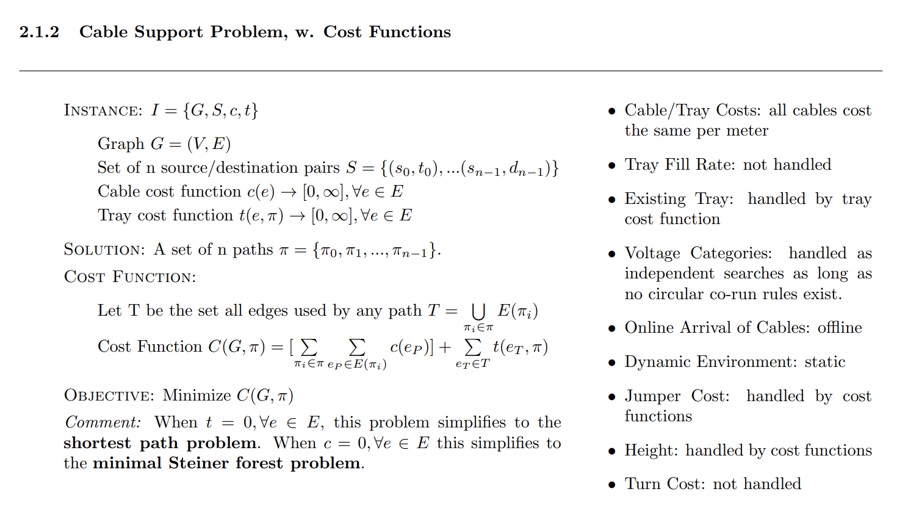
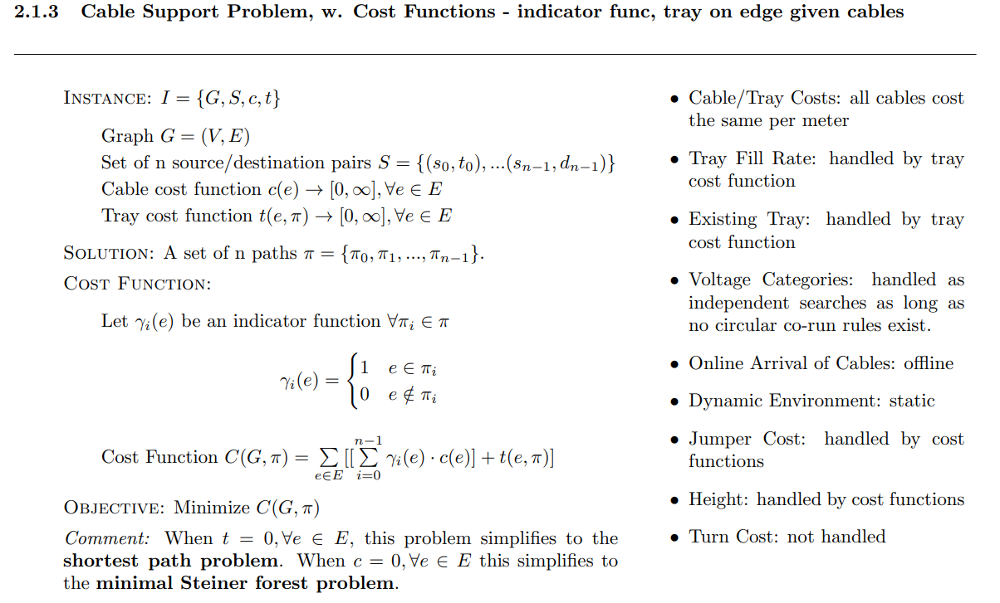

# Problem Description 



## Alternative (Equivalent) Problem Description



# Cost Functions
```math

dist(e) = \sqrt{(x_2 - x_1)^2 + (y_2 - y_1)^2 + (z_2 - z_1)^2}
```


```math

c(e) = dist(e)


```

```math
t(e, \pi) = dist(e)*6
```


# Environment

| | |
|---|---|
| **Number of Nodes** | 710 |
| **Number of Edges** | 2652 |
| **Number of Cables** | 13 |

# Algorithm Comparison


| Algorithm Name | Description | A: Total Path Length | B: Total Used Edge Length *6 | Total Cost (A+B) | <div style="width:600px">Visualization</div> |
|---|---|---|---|---|---|
| **Dijkstra Shortest Path** |  Shortest path, minimizing total cable length, ignoring tray costs.  | 95.6 | 344.61 | 440.21 |  |
| **Prioritized Dijkstra Shortest Path** |  Sequentially running Dijkstra, laying down tray at each step, minimizing total cost tray costs.  | 112.97 | 200.13 | 313.1 |  |
| **Prioritized Dijkstra Shortest Path with 5 Restarts** |  Sequentially running Dijkstra, laying down tray at each step, minimizing total cost tray costs. Permutes the order of cables to attempt to find lower cost solutions. Restarts = 5  | 123.14 | 179.67 | 302.81 |  |
| **Prioritized Dijkstra Shortest Path with 50 Restarts** |  Sequentially running Dijkstra, laying down tray at each step, minimizing total cost tray costs. Permutes the order of cables to attempt to find lower cost solutions. Restarts = 50  | 103.9 | 189.23 | 293.14 |  |
| **Steiner Tree mehlhorn approximation** |  Runs the mehlhorn steiner tree approximation algorithm, with sources/dest as terminals, then runs dijkstra to find shortest paths.   | 129.56 | 308.8 | 438.36 |  |
| **Steiner Tree kou approximation** |  Runs the kou steiner tree approximation algorithm, with sources/dest as terminals, then runs dijkstra to find shortest paths.   | 137.36 | 178.84 | 316.2 |  |
| **Iterative Tray Placement** |  Run Dijkstra to find shortest path for each cable. Look at the most frequently used edge across all paths, and place a tray there.  Rerun Dijkstra with the updated graph (with the tray placed) to update paths. Repeat for n iterations.   | 104.51 | 239.88 | 344.39 |  |
